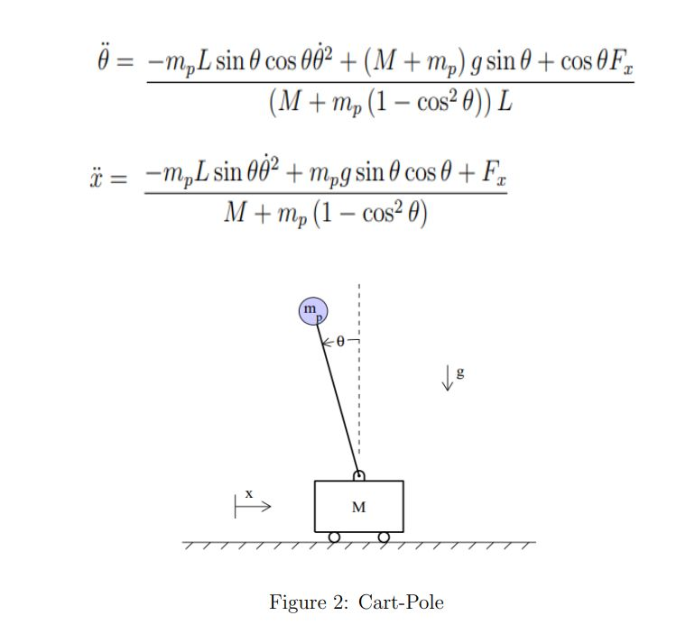

# PROBLEM

The dynamics of the cart-pole system shown in Figure  is given below. Here M and mp is the mass (kg) of the cart and pole respectively. The linear displacement (in m) of the cart is s denoted by x, g is the acceleration due to gravity, θ is the angular displacement (radians) of the pole of length L (in m) and Fx is the input force applied to the cart (in N). Find the optimal control input (Fx) that takes the pole from the initial angular position θ(0) = π/6 to the desired angular position θ(tf) = 0? (Here, the final time tf is a free variable.) M = 20 Kg, mp = 0.5 kg, L = 0.5 m; 

<!-- include img -->

## Is the system controllable?
> Note: Assuming that &theta; is small we can linearize the non-linear problem to get A and B.  

$$
\begin{aligned}
& \ddot{\theta}=\frac{-m_p L \sin \theta \cos \theta \dot{\theta}^2+\left(M+m_p\right) g \sin \theta+\cos \theta F_x}{\left(M+m_p\left(1-\cos ^2 \theta\right)\right) L} \\
& \ddot{x}=\frac{-m_p L \sin \theta \dot{\theta}^2+m_p g \sin \theta \cos \theta+F_x}{M+m_p\left(1-\cos ^2 \theta\right)}
\end{aligned}
$$

$\begin{aligned} & \Rightarrow \text { let, } \\ & x=\left[\begin{array}{l}x_1 \\ x_2 \\ x_3 \\ x_4\end{array}\right] \\ & x_1=x \\ & x_2=\dot{x} \\ & x_3=\theta \\ & x_4=\dot{\theta} \\ & u=F_x \\ & \end{aligned}$

$\begin{aligned} & \Rightarrow M l \ddot{\theta}=(M+m) g \theta-u \\ & \Rightarrow M \ddot{x}=u-m g \theta \\ & \Rightarrow \ddot{\theta}=\frac{(M+m) g \theta}{M l}-\frac{u}{M l} \\ & \Rightarrow \ddot{x}=\frac{u}{M}-\frac{m g}{M} \theta\end{aligned}$

$\left[\begin{array}{c}\dot{x}_1 \\ \dot{x}_2 \\ \dot{x}_3 \\ \dot{x}_4\end{array}\right]=\left[\begin{array}{cccc}0 & 1 & 0 & 0 \\ 0 & 0 & \frac{-m g}{M} & 0 \\ 0 & 0 & 0 & 1 \\ 0 & 0 & \frac{(M+m)g}{M l} & 0\end{array}\right]\left[\begin{array}{l}x_1 \\ x_2 \\ x_3 \\ x_4\end{array}\right]+\left[\begin{array}{c}0 \\ \frac{1}{M} \\ 0 \\ \frac{-1}{M l}\end{array}\right] u$
 
$\dot{x}=A x+B U$

>Given,  
>M = 20 kg  
>g = 9.8 m / s2  
>m = 0.5 kg  
>l = 0.5 m  

> Controllability matrix, CM = CM = [B AB A2B A3B]  

### 1. Riccati Method

<!-- include giff -->

