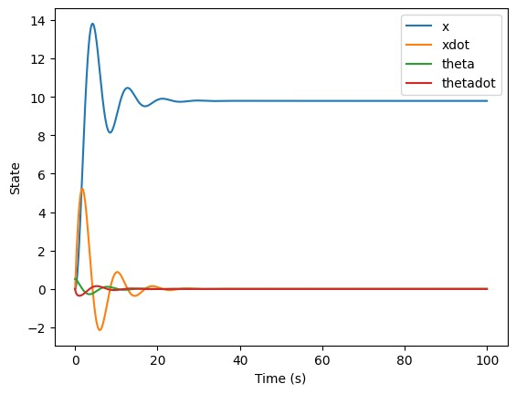

# PROBLEM

The dynamics of the cart-pole system shown in Figure  is given below. Here M and mp is the mass (kg) of the cart and pole respectively. The linear displacement (in m) of the cart is s denoted by x, g is the acceleration due to gravity, θ is the angular displacement (radians) of the pole of length L (in m) and Fx is the input force applied to the cart (in N). Find the optimal control input (Fx) that takes the pole from the initial angular position θ(0) = π/6 to the desired angular position θ(tf) = 0? (Here, the final time tf is a free variable.) M = 20 Kg, mp = 0.5 kg, L = 0.5 m; 

<!-- include img -->
 

## Is the system controllable?
> Note: Assuming that &theta; is small we can linearize the non-linear problem to get A and B.  

\[
\begin{aligned}
\ddot{\theta} &= \frac{-m_p L \sin\theta \cos\theta \dot{\theta}^2 + (M + m_p) g \sin\theta + \cos\theta F_x}{(M + m_p (1 - \cos^2\theta)) L} \\
\ddot{x} &= \frac{-m_p L \sin\theta \dot{\theta}^2 + m_p g \sin\theta \cos\theta + F_x}{M + m_p (1 - \cos^2\theta)}
\end{aligned}
\]

\[
\begin{aligned} 
& \Rightarrow \text { let, } \\ 
& x=\begin{bmatrix} x_1 \\ x_2 \\ x_3 \\ x_4 \end{bmatrix} \\ 
& x_1=x \\ 
& x_2=\dot{x} \\ 
& x_3=\theta \\ 
& x_4=\dot{\theta} \\ 
& u=F_x \\ 
\end{aligned}
\]

\[
\begin{aligned} 
& \Rightarrow M l \ddot{\theta}=(M+m) g \theta - u \\ 
& \Rightarrow M \ddot{x}=u - m g \theta \\ 
& \Rightarrow \ddot{\theta}=\frac{(M+m) g \theta}{M l} - \frac{u}{M l} \\ 
& \Rightarrow \ddot{x}=\frac{u}{M} - \frac{m g}{M} \theta
\end{aligned}
\]

\[
\begin{bmatrix} 
\dot{x}_1 \\ \dot{x}_2 \\ \dot{x}_3 \\ \dot{x}_4
\end{bmatrix}
=
\begin{bmatrix} 
0 & 1 & 0 & 0 \\ 
0 & 0 & \frac{-m g}{M} & 0 \\ 
0 & 0 & 0 & 1 \\ 
0 & 0 & \frac{(M+m)g}{M l} & 0
\end{bmatrix}
\begin{bmatrix} 
x_1 \\ x_2 \\ x_3 \\ x_4
\end{bmatrix}
+
\begin{bmatrix} 
0 \\ \frac{1}{M} \\ 0 \\ \frac{-1}{M l}
\end{bmatrix} u
\]

 
$\dot{x}=A x+B U$

>Given,  
>M = 20 kg  
>g = 9.8 m / s2  
>m = 0.5 kg  
>l = 0.5 m  

> Controllability matrix, CM = CM = [B AB A2B A3B]  
> By substituting M, g, m, l and calculating the rank of the controllability matrix we get,
> rank(CM) = 4
> Which means the system is controllable

### 1. Riccati Method
*If a system is controllable we can make the system stable* 

By calculating the eigen values of A, we get some non-negative eigen values which means presently the system is unstable. We can make the system stable since the system is controllable. 

> Here we solve for P and get K.

Now following,  
U = -KX  
Xdot = AX + BU  

 

starting from the initial state X0 = [0 0 &pi;/6 0] we get the following results.

| itr | x           | xdot        | theta      | thetadot    | u           |
| --- | -----------| -----------| ----------| -----------| -----------|
| 0   | 0.000000    | 0.000000   | 0.523599  | 0.000000   | 0.000000   |
| 1   | 0.000000    | 0.059975   | 0.523599  | -0.017324 | 122.515388 |
| 2   | -0.000600 | 0.119574   | 0.523426 | -0.033898 | 121.764630 |
| 3   | -0.001795 | 0.178798  | 0.523087 | -0.049753 | 121.011577 |
| ... | ...         | ...           | ...           | ...             | ... 
|1995 |-10.630456 | 0.018014|  0.000081| -0.001051|    0.012374|
|1996 |-10.630637  |0.018019  |0.000070 |-0.001045    |0.010227|
|1997| -10.630817|  0.018022|  0.000060 |-0.001039  |  0.008092|
|1998 |-10.630997  |0.018025  |0.000049 |-0.001033    |0.005970|
|1999 |-10.631177|  0.018027|  0.000039 |-0.001027  |  0.003861          |

## simulation
 
*  
*  
*  
*  
*   

### 2. REINFORCE ALGORITHM
Reinforce algorithm is a policy gradient method for reinforcement learning, where the goal is to learn a policy that maximizes the expected cumulative reward over time. It is an on-policy algorithm, which means that it updates the policy while interacting with the environment.

Here are the steps of the REINFORCE algorithm:

Initialize the policy parameters $\theta$ randomly by neural network which generates probabilities of an action.
Repeat for each episode:
Generate a trajectory by following the current policy $\pi_\theta$.
For each timestep $t$ in the trajectory:
Compute the discounted return $G_t=\sum_{k=t}^T\gamma^{k-t}r_k$, where $T$ is the time horizon of the episode and $\gamma$ is the discount factor.
Compute the log-probability of the action taken at timestep $t$ under the policy $\pi_\theta$: $\log \pi_\theta(a_t|s_t)$.
Compute the policy gradient at timestep $t$: $\nabla_\theta \log \pi_\theta(a_t|s_t) G_t$.
Update the policy parameters using the mean of the policy gradients over the trajectory:
<!-- insert img -->
*  

 
where $\alpha$ is the learning rate and $N$ is the length of the trajectory.
The intuition behind the REINFORCE algorithm is that it encourages the policy to increase the probability of actions that lead to higher returns and decrease the probability of actions that lead to lower returns. By following the gradient of the expected return with respect to the policy parameters, the algorithm can update the policy parameters to improve the policy.

> Reward used is below:
*  

> PLOTS
> 1. Theta vs Time
*  
* 2. Position vs time
*  

### 3. Policy Iteration
*  
* *  

### 4. Vaue Iteration
*  
*  

### 5. DQN-Algorithm
The main idea behind Q-learning is that if we had a function Q* :State×Action→R, that could tell us what our return would be, if we were to take an action in a given state, then we could easily construct a policy that maximizes our rewards:
$$
\begin{aligned}
\pi^{*}(s) = argmax_{a} Q^{*}(s,a)
\end{aligned}
$$

However, we don’t know everything about the world, so we don’t have access to Q*. But, since neural networks are universal function approximators, we can simply create one and train it to resemble Q*.

For our training update rule, we’ll use a fact that every Q function for some policy obeys the Bellman equation:

$$
\begin{aligned}
Q^{\pi}(s, a) = r + \gamma Q^{\pi}(s', \pi(s'))
\end{aligned}
$$

The difference between the two sides of the equality is known as the temporal difference error, 
δ:

$$
\begin{aligned}
δ = Q(s, a) - (r + \gamma* max_{a}'Q(s', a)
\end{aligned})
$$

To minimize this error, we will use the Huber loss. The Huber loss acts like the mean squared error when the error is small, but like the mean absolute error when the error is large - this makes it more robust to outliers when the estimates of Q are very noisy.

#### DQN plot

 
 

